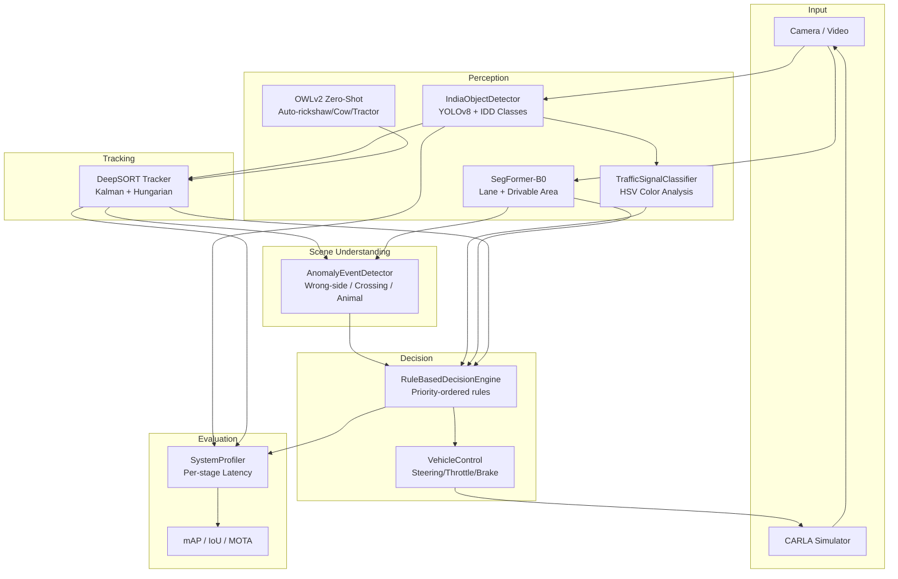

# 🏗️ System Architecture — ADAS Level 4 (India-Focused)

## Pipeline Overview



## Module Details

### Perception Layer

| Module | File | Model | Purpose |
|---|---|---|---|
| Object Detection | `src/perception/india_detector.py` | YOLOv8n (COCO → India mapping) | Detect vehicles, pedestrians, animals |
| Zero-Shot Detection | `src/perception/owl_detector.py` | OWLv2 | Detect auto-rickshaws, cows, handcarts |
| Lane Segmentation | `src/lane_detection/segformer_lane_detector.py` | SegFormer-B0 | Drivable area + lane boundaries |
| Traffic Signal | `src/traffic_control/signal_classifier.py` | HSV heuristic | Red/Yellow/Green classification |

### Tracking Layer

| Module | File | Algorithm | Purpose |
|---|---|---|---|
| Kalman Filter | `src/tracking/kalman_filter.py` | 8-state KF | Bounding box state estimation |
| DeepSORT | `src/tracking/deep_sort_tracker.py` | KF + Hungarian + IoU | Multi-object tracking with IDs |

### Decision Layer

| Module | File | Approach | Purpose |
|---|---|---|---|
| Rule Engine | `src/decision/rule_engine.py` | Priority-ordered rules | Brake/steer/stop decisions |
| Control Output | `src/decision/control_output.py` | Data classes | CARLA/ROS-compatible commands |

### Safety Layer

| Module | File | Detection | Purpose |
|---|---|---|---|
| Anomaly Detector | `src/anomaly/event_detector.py` | Velocity + spatial heuristics | Wrong-side, crossing, animal, pothole |

### Simulation Layer

| Module | File | Purpose |
|---|---|---|
| CARLA Bridge | `src/simulation/carla_bridge.py` | Connect to CARLA, spawn scene, apply control |
| Sensor Manager | `src/simulation/sensor_manager.py` | Camera lifecycle, frame buffering |

---

## Data Flow

```
Frame (1280×720 BGR)
  │
  ├──→ IndiaObjectDetector ──→ [Detection] ──→ DeepSORT ──→ [Track]
  │         ↓                                       ↓
  │    OWLv2 (every 10 frames)              Velocity estimation
  │                                                  ↓
  ├──→ SegFormer ──→ [Lane Mask] ──→ ┐    AnomalyEventDetector
  │                                   │         ↓
  ├──→ TrafficClassifier ──────────→ ┤    [AnomalyEvent]
  │                                   │         ↓
  └───────────────────────────────→ SceneContext
                                         ↓
                                  RuleBasedDecisionEngine
                                         ↓
                                   DecisionOutput
                                         ↓
                                   VehicleControl → CARLA / HUD
```

---

## Indian Datasets

| Dataset | URL | Classes | Purpose |
|---|---|---|---|
| **IDD** | http://idd.insaan.iiit.ac.in/ | 30 | Indian road classes (auto-rickshaw, animal) |
| **BDD100K** | https://bdd-data.berkeley.edu/ | 10 | Diverse driving scenarios |
| **Mapillary Vistas** | https://www.mapillary.com/dataset/vistas | 66 | Fine-grained street segmentation |
| **Custom (YouTube)** | Dashcam footage | 8+ | Annotated with CVAT for India-specific objects |

---

## Configuration

All parameters are centralized in `config.yaml`:
- Model paths and thresholds
- Per-category confidence levels
- Tracking parameters (max_age, min_hits)
- Decision distances (brake thresholds)
- CARLA simulation settings
- Dataset references
