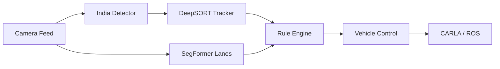

<div align="center">

# 🇮🇳 ADAS Level 4 — India-Focused Autonomous Driving

### A Modular Perception-Tracking-Decision Pipeline for Chaotic Traffic

[](https://www.python.org/)
[](https://pytorch.org/)
[](https://github.com/ultralytics/ultralytics)
[](https://huggingface.co/)
[](https://carla.org/)

<br />

**Robust autonomous driving perception adapted for the chaos of Indian streets.**


```mermaid
graph LR
    Camera[Camera Feed] --> DET[India Detector]
    DET --> TRACK[DeepSORT Tracker]
    Camera --> SEG[SegFormer Lanes]
    TRACK --> DECIDE[Rule Engine]
    SEG --> DECIDE
    DECIDE --> CTRL[Vehicle Control]
    CTRL --> CARLA[CARLA / ROS]
```

</div>

---

## 🎯 What Makes This Different

This is **not** another generic ADAS demo. Built specifically for Indian roads:

| Challenge | Our Solution |
|---|---|
| Auto-rickshaws, handcarts | **OWLv2 zero-shot detection** — no training needed |
| Cows/dogs on road | **Per-category thresholds** (animals: 0.20 confidence) |
| Wrong-side driving | **Anomaly detector** with velocity analysis |
| Faded/missing lanes | **SegFormer drivable area** instead of line detection |
| Chaotic density | **DeepSORT** tracking 50+ objects simultaneously |
| Potholes everywhere | **Contrast-based road anomaly detection** |

---

## 🧱 Architecture

```
Camera → IndiaDetector(YOLOv8) → DeepSORT → AnomalyDetector → RuleEngine → Control
              ↓                                    ↑
         OWLv2 (async)                      SegFormer Lanes
```

See [ARCHITECTURE.md](ARCHITECTURE.md) for full system diagrams.

### Modules

| Module | Description | Key File |
|---|---|---|
| 🔍 Object Detection | YOLOv8 + IDD class mapping | `src/perception/india_detector.py` |
| 🦉 Zero-Shot Detection | OWLv2 for rare Indian objects | `src/perception/owl_detector.py` |
| 🛣️ Lane Segmentation | SegFormer-B0 drivable area | `src/lane_detection/segformer_lane_detector.py` |
| 📦 Multi-Object Tracking | DeepSORT (Kalman + Hungarian) | `src/tracking/deep_sort_tracker.py` |
| ⚠️ Anomaly Detection | Wrong-side, crossing, animal, pothole | `src/anomaly/event_detector.py` |
| 🧠 Decision Engine | Priority-ordered rule system | `src/decision/rule_engine.py` |
| 🎮 CARLA Simulation | Full simulation bridge | `src/simulation/carla_bridge.py` |
| 📊 Evaluation | mAP, IoU, MOTA, FPS profiling | `src/evaluation/metrics.py` |

---

## 📊 Indian Datasets

| Dataset | Classes | Purpose |
|---|---|---|
| [IDD](http://idd.insaan.iiit.ac.in/) | 30 | Indian road classes (auto-rickshaw, animal) |
| [BDD100K](https://bdd-data.berkeley.edu/) | 10 | Diverse driving scenarios |
| [Mapillary Vistas](https://www.mapillary.com/dataset/vistas) | 66 | Fine-grained street segmentation |
| Custom (YouTube + CVAT) | 8+ | India-specific dashcam annotations |

---

## 🚀 Quick Start

### Option A: Video Processing
```bash
# Install dependencies
pip install -r requirements.txt

# Run on video
python -m src.adas_pipeline_l4 --source data/samples/indian_road.mp4 --device cuda

# Run on webcam
python -m src.adas_pipeline_l4 --source 0

# Headless mode (save output)
python -m src.adas_pipeline_l4 --source video.mp4 --headless --output result.mp4
```

### Option B: CARLA Simulation
```bash
# 1. Start CARLA server (separate terminal)
./CarlaUE4.exe  # Windows

# 2. Run pipeline with CARLA
python -m src.adas_pipeline_l4 --carla --config config.yaml
```

### Run Tests
```bash
python -m pytest tests/test_l4_pipeline.py -v
```

---

## 📂 Project Structure

```text
ADAS-L4-India/
├── config.yaml                    # Central configuration
├── src/
│   ├── adas_pipeline_l4.py        # 🎯 Master L4 Orchestrator
│   ├── perception/
│   │   ├── india_detector.py      # YOLOv8 India-aware detection
│   │   └── owl_detector.py        # OWLv2 zero-shot detection
│   ├── lane_detection/
│   │   └── segformer_lane_detector.py
│   ├── tracking/
│   │   ├── kalman_filter.py       # 8-state Kalman filter
│   │   └── deep_sort_tracker.py   # DeepSORT tracker
│   ├── decision/
│   │   ├── rule_engine.py         # Priority-ordered decisions
│   │   └── control_output.py      # Vehicle control commands
│   ├── anomaly/
│   │   └── event_detector.py      # Edge-case detection
│   ├── simulation/
│   │   ├── carla_bridge.py        # CARLA integration
│   │   └── sensor_manager.py      # Camera management
│   └── evaluation/
│       └── metrics.py             # mAP, IoU, MOTA, profiling
├── tests/
│   └── test_l4_pipeline.py        # Comprehensive test suite
├── ARCHITECTURE.md                # System architecture docs
├── THESIS_REPORT.md               # Academic thesis report
└── requirements.txt
```

---

## 📄 Documentation

- **[ARCHITECTURE.md](ARCHITECTURE.md)** — System architecture with diagrams
- **[THESIS_REPORT.md](THESIS_REPORT.md)** — Academic thesis report
- **[config.yaml](config.yaml)** — All tunable parameters

---

<div align="center">

### 📄 [Read the Full Thesis Report](THESIS_REPORT.md)

*Problem statement, methodology, dataset analysis, and evaluation framework.*

</div>
