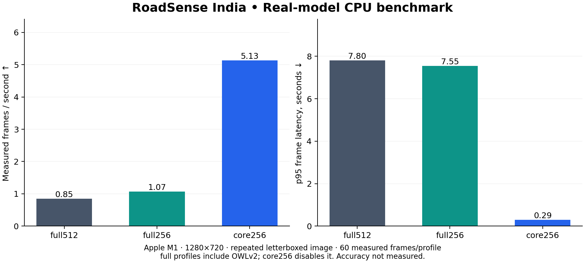
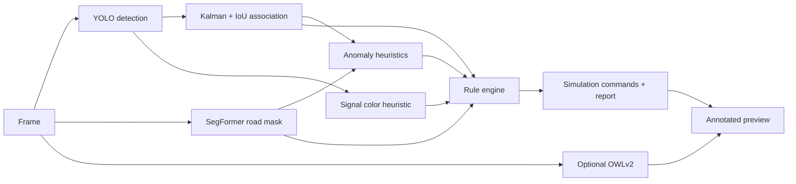

# RoadSense India

### Hybrid vision models for road-scene perception, tracking and simulation

A personal engineering project combining YOLOv8, SegFormer, optional OWLv2,
multi-object tracking and a rule engine. Designed around mixed road users and
Indian-road research questions, with measured runtime costs and reproducible tests.

[Benchmark report](benchmarks/mac_m1_cpu/README.md) · [Architecture](ARCHITECTURE.md) ·
[Model card](docs/MODEL_CARD.md) · [Engineering notes](docs/ENGINEERING.md) ·
[Test workflow](.github/workflows/ci.yml)

[](https://colab.research.google.com/github/Harsh-ryUk/Hybrid-Transformer-ADAS-India-Perspective/blob/main/notebooks/colab_benchmark.ipynb)

[Colab GPU guide](docs/COLAB.md) · [Publish new measurements](docs/RESULTS.md)



The measured workload uses a repeated sample image on an Apple M1 CPU. It measures
latency, not Indian-road accuracy. This is a research/simulation prototype;
legacy `L4` filenames do not establish Level 4 autonomous-driving capability.

## Run it

Python 3.10–3.11 is the CI target; checked-in CPU measurements used Python 3.9.6.

```bash
python -m venv .venv
source .venv/bin/activate
pip install -r requirements.txt -c constraints-tested.txt

# Compact CPU demo: YOLO + SegFormer + tracking + scene rules
python -m src.adas_pipeline_l4 --config configs/cpu.yaml --source video.mp4 --device cpu --headless --output result.mp4

# Full model configuration, including periodic OWLv2
python -m src.adas_pipeline_l4 --config config.yaml --source video.mp4 --device cpu
```

Weights download on first use. `configs/cpu.yaml` disables supplemental OWLv2;
it is a different operating profile, not an equivalent prediction path.
The full profile is substantially slower on CPU. Webcam source: `--source 0`.

## Measure the entire pipeline

```bash
pip install -r requirements-dev.txt
python scripts/benchmark_pipeline.py --profile all --source sample --frames 30 --warmup 10 --repeats 2 --threads 2 --output runs/benchmark/result.json
python scripts/summarize_benchmark.py --directory runs/benchmark
```

The runner uses real models and creates per-frame CSV/JSON traces, previews and a
comparison report. Each profile runs in a separate process. It records warmup,
cold initialization, throughput, p50/p95/p99 frame latency, every processing stage,
process peak RSS, source/config/code hashes, model revisions and package versions.
Full runs fail if OWLv2 does not actually complete inference.

| Measured Apple M1 CPU profile | FPS | p95 end-to-end ms | Peak RSS MiB |
|---|---:|---:|---:|
| `full512` | 0.85 | 7804.2 | 2226 |
| `full256` | 1.07 | 7552.7 | 2229 |
| `core256` | 5.13 | 289.2 | 440 |

These are real-model measurements, not accuracy scores. CUDA/Colab results have
not been measured yet. Run the notebook with a GPU runtime to produce a separate
report; do not replace CPU results with GPU numbers or infer real-time readiness
from a faster sample run.

```bash
python scripts/benchmark_pipeline.py --device cuda --profile all --source sample --frames 100 --warmup 20 --repeats 3 --threads 2 --output runs/colab_sample/result.json
python scripts/summarize_benchmark.py --directory runs/colab_sample
```

Explicit CUDA requests fail if unavailable. CUDA measurements synchronize stage
boundaries and frame completion, recording GPU identity and PyTorch peak allocated/
reserved memory separately from process RSS. This serial instrumentation adds
overhead; it is not a batch-throughput or overlapped execution benchmark.

| Profile | SegFormer network input | OWLv2 | Purpose |
|---|---|---|---|
| `full512` | 512×512 | Every 10 frames, synchronous | Full configuration reference |
| `full256` | 256×144 | Every 10 frames, synchronous | Isolate the resolution tradeoff |
| `core256` | 256×144 | Disabled | Measure the compact core |

Use `--source /path/to/dashcam.mp4` for video and `--no-render` for headless
processing. Provide enough frames for warmup plus measurement. Cached runs can
use `HF_HUB_OFFLINE=1 TRANSFORMERS_OFFLINE=1`.

## How it works


```mermaid
flowchart LR
    Camera[Frame] --> YOLO[YOLO detection]
    Camera --> Seg[SegFormer road mask]
    Camera --> OWL[Optional OWLv2]
    YOLO --> Track[Kalman + IoU association]
    YOLO --> Signal[Signal color heuristic]
    Track --> Scene[Anomaly heuristics]
    Seg --> Scene
    Scene --> Rules[Rule engine]
    Signal --> Rules
    Track --> Rules
    Seg --> Rules
    Rules --> Output[Simulation commands + report]
    OWL --> Preview[Annotated preview]
    Output --> Preview
```

OWLv2 detections are supplemental display results, not fused into tracking or
decisions. The tracker is SORT-style Kalman/IoU/Hungarian association; its legacy
`DeepSORTTracker` class has no learned appearance encoder. SegFormer estimates
drivable-region edges, not trained lane-marking segmentation.

## Engineering decisions

- Bound profiler history and remove expired tracker metadata on long runs.
- Blend overlays in image regions and build confusion matrices with one histogram.
- Convert BGR to RGB before transformer preprocessing and preserve model label taxonomies.
- Reject invalid frames/configs; resolve the same CPU/CUDA device for every module.
- Expose OWLv2 completion, failure and result age; drain workers during cleanup.
- Test model contracts and orchestration offline; measure real models separately.

`zero_shot.background: true` is an optional worker mode with one outstanding job.
It drops work while busy and returns older cached boxes. This changes freshness
and can contend with primary models. It is not a guaranteed real-time fix.
The current segmentation path first resizes capture input to 256×144 before the
network resize. Larger network dimensions do not restore lost source detail.

## Test it

```bash
pip install -r requirements-dev.txt -c constraints-tested.txt
python -m pytest -q
ruff check --select E9,F63,F7,F82 src scripts tests
```

Offline tests cover tracking, rules, anomalies, metrics, preprocessing,
input/config boundaries, background scheduling and legacy orchestration.
CI runs tests and syntax checks on Python 3.10/3.11; its hosted status will become
available after this local work is published.

## Continue the research

The sample has no ground truth: mAP, road IoU and MOTA remain unmeasured.
The [model card](docs/MODEL_CARD.md) distinguishes implementation, measurements
and unvalidated capabilities. IDD/BDD100K preparation and training recipes live
in `scripts/prepare_idd.py`, `scripts/prepare_bdd100k.py`,
`scripts/train_yolo_idd.py` and `scripts/train_segformer_idd.py`.

The project now has reproducible measurement, regression tests, device/input
contracts, CI and an explicit model card: useful production-minded engineering
for a portfolio. It is not an industry-qualified ADAS product. Held-out accuracy,
target-device deadlines, failure handling and closed-loop safety need separate
evidence. See [the results protocol](docs/RESULTS.md) for acceptance criteria and
how to report the next experiments without overstating them.

The next evidence milestone is an annotated, held-out Indian dashcam set spanning
day/night, rain, occlusion, animals and mixed traffic. Dataset access, trained
weights, GPU deployment and CARLA/ROS integration are separate validation tasks.
For the optional ONNX demo, install `onnxruntime` (CPU/macOS) or a supported
`onnxruntime-gpu` build separately.

## Attribution

Models: [Ultralytics YOLO](https://github.com/ultralytics/ultralytics),
[NVIDIA SegFormer-B0](https://huggingface.co/nvidia/segformer-b0-finetuned-ade-512-512),
[Google OWLv2](https://huggingface.co/google/owlv2-base-patch16-ensemble).
Sample previews derive from Ultralytics' bundled `assets/bus.jpg`, not Indian-road
footage. Model, dependency and dataset licenses remain their own.
