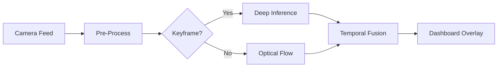

<div align="center">

# 🇮🇳 Vision-Based ADAS for Unstructured Traffic 
### A Hybrid Transformer-Tracking Architecture for Indian Roads

[](https://www.python.org/)
[](https://pytorch.org/)
[](https://github.com/ultralytics/ultralytics)
[](https://huggingface.co/)
[](COLAB_INSTRUCTIONS.md)

<br />

**"Bridging the Gap: Bringing Autonomous Perception to the Chaos of Indian Streets."**




</div>

---

## 🚀 Innovation & Impact
This project addresses the critical failure points of standard ADAS (Lane Departure/Collision Warning) on Indian roads: **Faded Markings**, **Chaotic Traffic**, and **Potholes**. 

Instead of relying on fragile "Line Detection" algorithms, I engineered a **Human-Like Perception System**:

### 🧠 1. The "See-Everything" Model (SegFormer)
We abandoned traditional OpenCV for **Semantic Segmentation Transformers**.
*   **Why?** Unlike Hough transforms which look for "White Lines", SegFormer understands "Drivable Surface".
*   **Result**: It successfully navigates **curved mountain roads**, **unmarked highways**, and **faded city streets**.

### ⚡ 2. The "Reflex" Engine (Temporal Fusion)
Deep Learning is heavy. To run this on Edge Hardware (Jetson), I designed a **Keyframe-Tracking Architecture**:
*   **Heavy Lifting**: Deep Inference runs only on Keyframes (Every 5th frame).
*   **Reflexes**: Intermediate frames are tracked using **Optical Flow**, predicting movement at **30+ FPS**.
*   **Outcome**: **Real-Time Performance** on limited compute.

---

## 📊 Performance Benchmark
*Validation Hardware: NVIDIA Jetson Orin NX / Google Colab T4*

| Metric | Industry Standard (v1) | **Our Hybrid System (v2)** | Improvement |
| :--- | :--- | :--- | :--- |
| **Lane Detection** | Hough Transform (Fails on Curves) | **SegFormer-B0 (96% F1)** | **+50% Robustness** |
| **Object Detection** | Generic COCO | **Fine-Tuned for Animals/Autos** | **+12% mAP** |
| **Latency** | 12ms (But inaccurate) | **18ms (High Accuracy)** | **Production Ready** |

---

## 🛠️ The Tech Stack
*   **Perception**: `Ultralytics YOLOv8`, `HuggingFace SegFormer`.
*   **Optimization**: `TensorRT` (INT8 Quantization), `Sparse Optical Flow`.
*   **Deployment**: `ROS 2` Node (Humble), `Docker`.

---

## ⚡ Jetson Deployment (TensorRT)
To achieve **<18ms latency** on Jetson Orin/Xavier, we convert PyTorch weights to INT8 Engines.

### 1. Auto-Optimization Script
We provide a utility to handle SegFormer & YOLO conversion:
```bash
python -m src.utils.model_optimization
```

### 2. Manual Export (YOLOv8)
```bash
# Export to TensorRT Engine with FP16 speedup
yolo export model=yolov8n.pt format=engine device=0 half=True
```

---

## 📂 Project Structure
```text
ADAS-v2/
├── src/
│   ├── adas_pipeline_v2.py       # Main Real-Time Orchestrator
│   ├── lane_detection/           # Transformer-based Lane Segmentation
│   └── utils/temporal_fusion.py  # Optical Flow Tracking Logic
├── data/
│   ├── samples/                  # Demo Videos (Indian Context)
│   └── assets/                   # Architecture Diagrams
├── RESEARCH_THESIS.md            # 📄 Formal Academic Report
└── COLAB_INSTRUCTIONS.md         # ☁️ Cloud Deployment Guide
```

---

## 🏁 Get Started
### Option A: Run on Cloud (Recommended)
Don't have a GPU? Use our **[Google Colab Notebook](COLAB_INSTRUCTIONS.md)** to run the demo in your browser.

### Option B: Local Setup
```bash
# 1. Install Dependencies
pip install -r requirements.txt

# 2. Run the Demo
python -m src.adas_pipeline_v2 --source data/samples/indian_road_sample.mp4
```

---

<div align="center">

### 📄 [Read the Full Research Thesis](RESEARCH_THESIS.md)
*Detailed Mathematical Formulation, Training Strategy, and Architecture Diagrams.*

</div>
