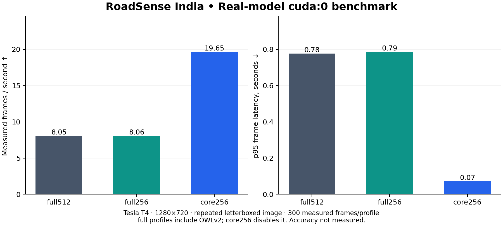

# RoadSense India — cuda:0 benchmark

Real YOLOv8n, SegFormer-B0 and (for full profiles) OWLv2 inference. No mock model timings.

Hardware: Tesla T4; device: cuda:0; PyTorch host threads: 2; input: 1280×720.

Workload: Repeated letterboxed image: bus.jpg. Each profile uses a separate process, 3 repeats of 100 measured frames, and 20 warmup frames per repeat. Frames include input copy/decode, perception, tracking, segmentation, signal classification, anomalies and decisions; rendering: True. Image loading/letterboxing, preview export and model initialization are excluded from warm throughput and reported separately where applicable.

| Profile | OWLv2 | SegFormer input | FPS | p50 frame ms | p95 frame ms | p99 frame ms | Peak process RSS MiB |
|---|---|---|---:|---:|---:|---:|---:|
| full512 | every 10 frames | 512×512 | 8.05 | 44.6 | 777.0 | 961.2 | 2977 |
| full256 | every 10 frames | 256×144 | 8.06 | 43.4 | 785.6 | 965.1 | 2881 |
| core256 | disabled | 256×144 | 19.65 | 44.9 | 71.7 | 74.1 | 2245 |

CUDA timing synchronizes stage boundaries and frame completion. This includes synchronization overhead and prevents cross-stage overlap.

| Profile | Peak PyTorch allocated MiB | Peak PyTorch reserved MiB |
|---|---:|---:|
| full512 | 1912.7 | 2564.0 |
| full256 | 1913.4 | 2568.0 |
| core256 | 80.7 | 106.0 |



## Where time goes

| Mean stage latency, ms | full512 | full256 | core256 |
|---|---:|---:|---:|
| detection_ms | 10.04 | 9.88 | 10.20 |
| zero_shot_ms | 75.68 | 76.39 | 0.00 |
| segmentation_ms | 34.24 | 28.53 | 31.17 |
| tracking_ms | 0.71 | 0.70 | 0.68 |
| signal_ms | 0.01 | 0.01 | 0.01 |
| anomaly_ms | 1.00 | 3.86 | 4.03 |
| decision_ms | 0.04 | 0.12 | 0.12 |
| visualization_ms | 1.82 | 3.92 | 4.13 |

## Interpretation

Compare stage means and periodic OWLv2 frames in the raw traces. The zero-shot mean is amortized over skipped frames; tail latency exposes occasional slow frames. A resolution change can alter masks. core256 is a different operating profile, not a speedup with identical outputs.

The full512 workload had 300/300 frames with an empty road mask; compact profiles can produce different masks and fitted boundaries. This is evidence of sensitivity to preprocessing/resolution, not evidence that either profile is accurate. Runtime coverage depends on the scenes present; near-zero stage time does not validate that feature. The CSV traffic_signal field, when present, records recognized/unknown states, not ground truth. Scenario tests cover rules separately, but moving-road footage with ground truth is needed for mAP, road IoU and MOTA. Those accuracy metrics are explicitly null in the JSON reports.

Process RSS includes Python, libraries and models. It is a process peak, not GPU memory or steady-state resident memory. CUDA peaks are PyTorch allocator statistics after warmup, not total driver/device usage or initialization peaks. Host load is recorded in each JSON and can change timings; p99 from 300 frames is descriptive, not an SLA.

## Session provenance and findings

Measured on 2026-09-30 UTC (2026-10-01 in India), using clean source commit
[`aa018dc54f538d314ff365b4c2a9943e71689822`](https://github.com/Harsh-ryUk/Hybrid-Transformer-ADAS-India-Perspective/tree/aa018dc54f538d314ff365b4c2a9943e71689822).
The official Colab MCP bridge executed this project's cells in a GPU runtime.
No Drive mount, private footage or repository credential was required.

| Environment | Observed value |
|---|---|
| GPU / driver | Tesla T4 / 580.82.07 |
| Python / Torch | 3.13.15 / 2.11.0+cu128 |
| Torch CUDA runtime | 12.8 (the driver's supported CUDA version is separately reported by nvidia-smi) |
| Transformers / Ultralytics | 4.57.6 / 8.4.170 |
| NumPy / SciPy / OpenCV | 2.1.3 / 1.16.3 / 5.0.0 |
| Project tests before inference | 70 passed in 16.78 seconds |

Repeat FPS values are recorded individually in each JSON; the core profile
varied from 18.49 to 22.36 FPS. Headline throughput aggregates all measured frames
and elapsed time, not the best repeat.

Evidence → finding → next experiment:

- The full profiles each completed 10 measured OWLv2 calls per repeat with no
  recorded inference errors. Raw every-tenth-frame spikes and approximately
  76 ms amortized zero-shot stage means identify synchronous OWLv2 as the main
  latency bottleneck. Evaluate bounded background scheduling on moving footage
  while measuring stale-box age and primary-model contention; it is not a
  guaranteed speedup or equivalent freshness.
- Reducing SegFormer network input did not meaningfully change full-profile
  aggregate FPS (8.05 versus 8.06). Compare quality and timing on an annotated
  set before treating resolution reduction as an optimization win.
- The core profile averaged 19.65 FPS, with 71.7 ms p95 and repeat variation.
  It removes OWLv2 and does not establish a sustained 20 FPS deadline. Longer
  decoded-video runs on a specified deployment device are the next latency test.
- Empty road masks in all full512 frames and nonzero compact masks show a
  preprocessing/resolution failure mode. All profiles issued `emergency_stop`
  on this repeated scene; traffic signal states remained `Unknown`. Neither
  output is ground-truth validated. Annotated moving-road data is needed for
  detection, segmentation, tracking and rule evaluation.

The sample SHA, YOLO checkpoint SHA and transformer checkpoint revisions match
the [CPU experiment](../mac_m1_cpu/README.md). CPU used 60 frames/profile, older
packages and source before CUDA synchronization, so no strictly paired hardware
speedup is claimed. The original CPU records and measured source archive remain
unchanged.

Installation exited successfully but emitted dependency conflicts for unused
preinstalled Gradio 6.26.0 and Diffusers 0.40.0 after downgrading Hugging Face Hub
to 0.36.2. Project tests and inference succeeded; this is not a conflict-free
global Colab environment. Use a fresh VM or isolated project environment for
follow-up work. `pip-freeze.txt` is an observed environment inventory (including
Colab-local packages), not a portable installation lock.

## Reproduce

```bash
pip install -r requirements-dev.txt
python scripts/benchmark_pipeline.py --device cuda:0 --profile all --source sample --frames 100 --warmup 20 --repeats 3 --threads 2 --width 1280 --height 720 --output runs/benchmark/result.json
python scripts/summarize_benchmark.py --directory runs/benchmark
```

Models download on the first run. After caching them, set HF_HUB_OFFLINE=1 and TRANSFORMERS_OFFLINE=1 for an offline repeat. For headless cost use --no-render; for real footage use --source /path/to/video.mp4 with enough frames for warmup and measurement.

## Evidence

[full512 JSON](full512.json) · [full256 JSON](full256.json) · [core256 JSON](core256.json)

[full512 raw CSV](full512.csv) · [full256 raw CSV](full256.csv) · [core256 raw CSV](core256.csv)

Each JSON records source/config/code hashes, checkpoint revisions, versions, cold initialization, warmup, per-repeat FPS, OWL completion/error status and all measured frame samples.

[Source commit](commit.txt) · [Clean checkout status](git-status.txt) ·
[Dependency inventory](pip-freeze.txt) · [GPU/driver](nvidia-smi.txt) ·
[Test output](tests.txt) · [Installation log](setup.log) · [Benchmark log](benchmark.log)

[full512 preview](full512.png) · [full256 preview](full256.png) · [core256 preview](core256.png)
